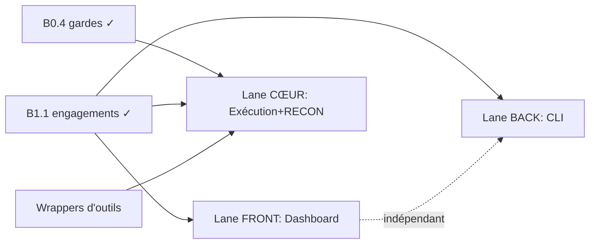

# Roadmap — Phase 1 (mécanique métier)

> Découpage en tâches assignables et parallélisables. Chaque tâche suit la
> `DEFINITION_OF_DONE.md`. On suit l'avancement dans les **GitHub Issues**
> (une issue par tâche) + un board Projects (To do / In progress / In review / Done).

## État
- **Phase 0 — fondations : TERMINÉE** (B0.1 stack, B0.2 données+audit, B0.3 auth+RBAC, B0.4 gardes).
- **B1.1 — mécanique d'engagement : TERMINÉE** (autorisation fichier/lien, scope, activation bloquante, check-target). Sert de **brique de référence**.

## Les chantiers de la Phase 1

### Lane FRONT — Dashboard (React)  · `track:dashboard`
- **D1** Auth : écran de login, stockage du token, appel `/auth/login` + `/auth/me`.
- **D2** Engagements : liste, création, détail (consomme l'API B1.1).
- **D3** Scope & autorisation : formulaires (upload fichier / lien), affichage du périmètre.
- **D4** Cockpit (squelette) : statut, phases, emplacement des futurs findings.
> Dépend de : API auth + engagements (déjà livrées). **Autonome, démarrable tout de suite.**

### Lane BACK — CLI (Python / Typer)  · `track:cli`
- **C1** `tegbessou auth login` : prompt masqué, stockage du token dans `~/.tegbessou/`. *(règle la douleur du mot de passe au terminal)*
- **C2** `tegbessou engagement create|list|show`.
- **C3** `tegbessou scope add`, `authorize`, `activate`, `check-target`.
> Dépend de : API (déjà livrée). **Autonome, démarrable tout de suite.**

### Lane CŒUR — Exécution + 1er module RECON  · `track:execution` *(chemin critique, K1NG5P4RR0W)*
- **E0** ⚠️ **Design à valider ensemble AVANT de coder** : isolation d'exécution (worker sandboxé, egress contrôlé), file de jobs Redis.
- **E1** Job Dispatcher + file Redis + un worker minimal.
- **E2** Wrappers d'outils normalisés (subfinder, httpx) — *fonctions pures, testables seules* → peuvent être faites en Lane BACK en appoint · `track:tools`.
- **E3** 1er module RECON qui exécute un outil **via le Scope Enforcer** (toute cible vérifiée) et journalise.
> Dépend de : gardes B0.4 + engagement B1.1 (déjà livrées).

## Graphe de dépendances

Les trois lanes avancent **en parallèle** sans se bloquer. Seul le cœur (E) exige
une conception préalable commune (E0).

## Cadence
- Une **issue par tâche**, assignée, avec labels de lane.
- PR → revue par un autre membre → merge (jamais d'auto-merge).
- **Point de synchro court** (async ou appel) régulier : ce qui est Done, ce qui bloque, qui prend la suite.
- Une brique prouvée avant la suivante (cf. Definition of Done).
